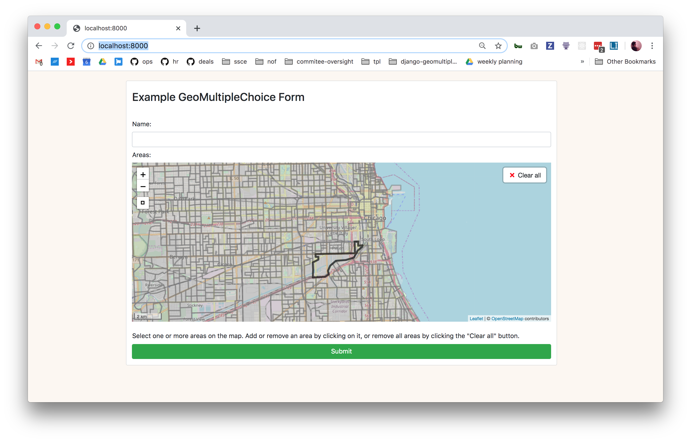

# 🗺 GeoMultipleChoice

A Django widget to select multiple geographic areas.


Originally created by [@jeancochrane](https://github.com/jeancochrane). Packaged up by [@beamalsky](https://github.com/beamalsky).

## Example app

This repo includes an `example` application using geographical data for 2018 Census block groups in Chicago. These data files are under version control, but you can also regenerate them yourself. Run:

```bash
docker-compose run --rm app make -f example/data/Makefile
```

To run the app, make sure you have [Docker](https://docs.docker.com/v17.09/engine/installation/) installed and run:

```bash
docker-compose up --build
```

You'll also need to import the Census data into your database, for which we've provided a sample `import_data.py`. Open a new window in your terminal and run:

```bash
docker-compose run --rm app python manage.py import_data
```

Visit http://localhost:8000/ and you should see the `example` form running!



## Widget options

The `example` project in this repo contains the following sample form implementation:

```python
class ExampleGeoMultipleChoiceForm(forms.ModelForm):
    class Meta:
        model = SelectedArea
        fields = '__all__'

    def __init__(self, *args, **kwargs):
        super().__init__(*args, **kwargs)

        settings_overrides = {
            'DEFAULT_ZOOM': 12,
            'DEFAULT_CENTER': (41.88, -87.7),
            'RESET_VIEW' : True, # Defaults to True
            # Sets the bounds of RESET VIEW; y min, x min, y max, x max
            # See https://github.com/makinacorpus/django-leaflet/issues/192
            'SPATIAL_EXTENT': (-87.3, 41.5, -88, 42.15),
            'MAP_ID': 'my-example-map', # Defaults to 'map'
            'MAP_HEIGHT': '400px',
            'MAP_WIDTH': '100%',
        }

        self.fields['areas'].widget = GeoMultipleChoiceWidget(
            choices=[
                (choice.id, choice) for choice
                in Area.objects.all()
            ],
            settings_overrides=settings_overrides
        )
```

`settings_overrides` accepts all arguments used by `django-leaflet` in its [LEAFLET_CONFIG](https://django-leaflet.readthedocs.io/en/latest/templates.html#configuration), in addition to the following:

- `MAP_ID` sets the html `id` for your widget map. Useful if you have multiple maps on the page.
- `MAP_HEIGHT` and `MAP_WIDTH` allow you to size the widget in your form. Must be used together.

`SelectedArea` is a model defined in `example/models.py`, and can be adjusted for your needs.

## Importing different Census data

TK

## Changing the data structure

TK

## Cleaning up

To remove data files, run:

```bash
docker-compose run --rm app make clean -f example/data/Makefile
```

To tear down the app and its volumes, run:

```bash
docker-compose down --volumes
```
